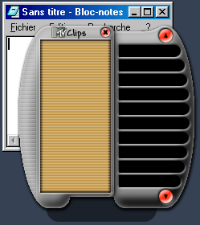



## no rectangular window with transparante bmp color

### Description

make a no rectangular window with transparante bitmap color same that k-jofol or over skinnable application with 2 api in a Dll.
 
### More Info
 

             |
---                |---
**Submitted On**   |2000-03-24 15:37:16
**By**             |[MarbleMad](https://github.com/Planet-Source-Code/PSCIndex/blob/master/ByAuthor/marblemad.md)
**Level**          |Beginner
**User Rating**    |4.5 (27 globes from 6 users)
**Compatibility**  |VB 5\.0, VB 6\.0
**Category**       |[Custom Controls/ Forms/  Menus](https://github.com/Planet-Source-Code/PSCIndex/blob/master/ByCategory/custom-controls-forms-menus__1-4.md)
**World**          |[Visual Basic](https://github.com/Planet-Source-Code/PSCIndex/blob/master/ByWorld/visual-basic.md)
**Archive File**   |[CODE\_UPLOAD43013262000\.zip](https://github.com/Planet-Source-Code/marblemad-no-rectangular-window-with-transparante-bmp-color__1-6804/archive/master.zip)

